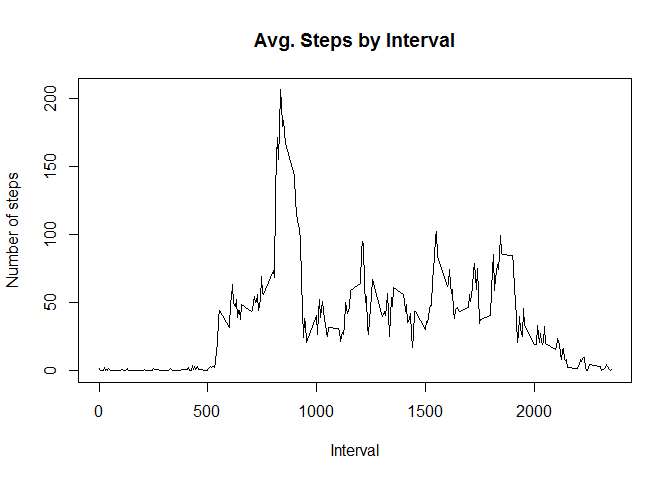

# Reproducible Research: Peer Assessment 1


## Loading and preprocessing the data
Unzip the file


```r
unzip("activity.zip")
```

And then, read the csv file to memory with variable name `dat`

```r
RawData <- read.csv("activity.csv")
```

## What is mean total number of steps taken per day?

Now we find avegare steps per day in toal:

```r
#total of steps divide by number of date
sum(RawData$steps,na.rm=TRUE)/length(unique(RawData$date))
```

```
## [1] 9354.23
```


Calculate number of steps each date and show the distribution of `steps` it by histogram


```r
stepByDate <- aggregate(steps ~ date, data = RawData,FUN=sum, na.rm = TRUE)

hist(stepByDate$steps)
```

 

Mean and median values of steps per day:


```r
mean(stepByDate$steps, na.rm=TRUE)
```

```
## [1] 10766.19
```

```r
median(stepByDate$steps,na.rm=TRUE)
```

```
## [1] 10765
```


## What is the average daily activity pattern?


Make a time series plot (i.e. type = "l") of the 5-minute interval (x-axis) and the average number of steps taken, averaged across all days (y-axis)

Aggreate number of steps by interval and show it in time series plot


```r
stepByInterval <- aggregate(steps ~ interval, data = RawData, FUN=mean, na.rm = TRUE)
plot(stepByInterval$interval, stepByInterval$steps, type = "l", 
     main="Avg. Steps by Interval", xlab="Interval", ylab="Number of steps")
```

 

Find 5-minute interval which have contains steps:

```r
# Fisrt, find maximun number of step
MaxNumOfSteps <- max(stepByInterval$steps)

# Then, find the Interval(s) that contain the maximun number of steps
stepByInterval[which(stepByInterval$steps == MaxNumOfSteps),]
```

```
##     interval    steps
## 104      835 206.1698
```


## Imputing missing values

Calculate and report the total number of missing values in the dataset (i.e. the total number of rows with NAs)

```r
sum(is.na(RawData$steps))
```

```
## [1] 2304
```

Filling in all of the missing values in the dataset with the mean steps value of the same interval (use the values which we just cacluate above in `stepByInterval` variable)  
Create a new dataset that is equal to the original dataset but with the missing data filled in.


```r
FilledData <- RawData

#Fill NA steps base on the same interval step value
for (i in min(stepByInterval$interval):max(stepByInterval$interval))
  {
   FilledData[which(is.na(FilledData$steps) & FilledData$interval==i),"steps"] <- max(stepByInterval[which(stepByInterval$interval==i),"steps"])
      
  }
```

Let Check number of NA value ò the new dataset

```r
#re-count number of NA value
sum(is.na(FilledData$steps))
```

```
## [1] 0
```

Make a histogram of the total number of steps taken each day and Calculate and report the mean and median total number of steps taken per day. Do these values differ from the estimates from the first part of the assignment? What is the impact of imputing missing data on the estimates of the total daily number of steps?


```r
stepByDateFilledNA <- aggregate(steps ~ date, data = FilledData,FUN=sum, na.rm = TRUE)
mean(stepByDateFilledNA$steps, na.rm=TRUE)
```

```
## [1] 10766.19
```

```r
median(stepByDateFilledNA$steps,na.rm=TRUE)
```

```
## [1] 10766.19
```

## Are there differences in activity patterns between weekdays and weekends?
