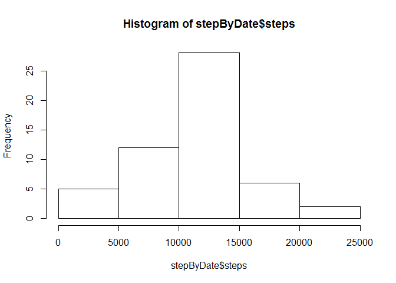
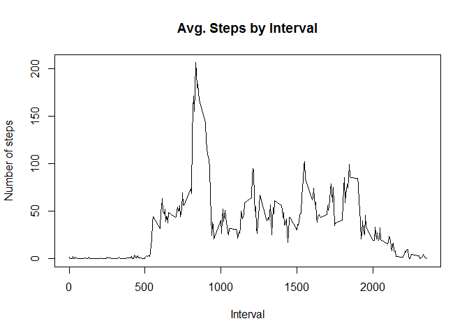

# Reproducible Research: Peer Assessment 1


## Loading and preprocessing the data
Unzip the file


```r
unzip("activity.zip")
```

And then, read the csv file to memory with variable name `dat`

```r
RawData <- read.csv("activity.csv")
```

## What is mean total number of steps taken per day?

Now we find avegare steps per day in toal:

```r
#total of steps divide by number of date
sum(RawData$steps,na.rm=TRUE)/length(unique(RawData$date))
```

```
## [1] 9354.23
```


Calculate number of steps each date and show the distribution of `steps` it by histogram


```r
stepByDate <- aggregate(steps ~ date, data = RawData,FUN=sum, na.rm = TRUE)

hist(stepByDate$steps)
```

 

Mean and median values of steps per day:


```r
mean(stepByDate$steps)
```

```
## [1] 10766.19
```

```r
median(stepByDate$steps)
```

```
## [1] 10765
```


## What is the average daily activity pattern?

Aggreate number of steps by interval and show it in time series plot


```r
stepByInterval <- aggregate(steps ~ interval, data = RawData, FUN=mean, na.rm = TRUE)
plot(stepByInterval$interval, stepByInterval$steps, type = "l", 
     main="Avg. Steps by Interval", xlab="Interval", ylab="Number of steps")
```

 


## Imputing missing values


## Are there differences in activity patterns between weekdays and weekends?
